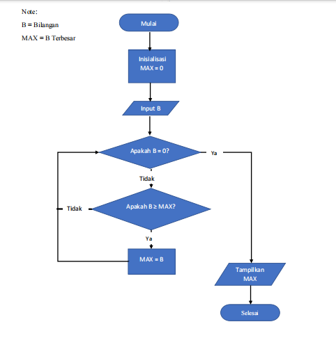
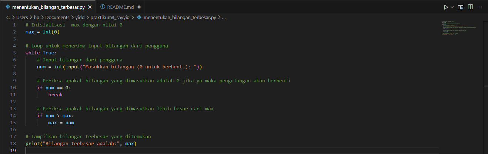
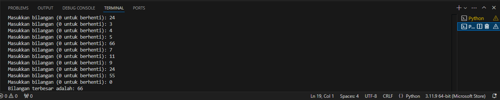

# sayyid-praktikum3
nama: Sayyid Sulthan Abyan

kelas: TI.24.A.5

Nim: 312410496

mata kuliah: bahasa pemograman

## Menentukan bilangan terbesar dari N bilangan yang di inputkan, untuk menentukan jumlah N masukan angka 0

### Flowchart
1.Mulai (Start): Di sinilah proses dimulai, titik awal dari seluruh algoritma.

2.Max = 0: Inisialisasi variabel Max ke 0. Ini berarti, sebelum memulai, kita asumsikan bahwa nilai maksimum adalah 0.

3.Input B: Meminta pengguna untuk memasukkan angka B.

4.Apakah B = 0?: Mengecek apakah nilai B adalah 0. -Jika Ya (Yes), ini berarti tidak ada lagi angka yang akan dimasukkan, dan kita lanjut ke langkah 5. -Jika Tidak (No), kita lanjut ke langkah 7 untuk mengecek apakah B lebih besar dari Max.

5.Output Max: Jika B adalah 0, kita keluarkan nilai Max sebagai hasil akhir, karena ini berarti kita sudah selesai memasukkan semua angka.

6.Selesai (End): Proses selesai. Tidak ada lagi angka yang diproses.

7.Apakah B > Max?: Jika B bukan 0, kita cek apakah B lebih besar dari Max. -Jika Ya (Yes), ini berarti kita menemukan angka yang lebih besar dari nilai maksimum saat ini. Maka, Max di-update dengan nilai B. -Jika Tidak (No), kita abaikan B dan tetap dengan nilai Max saat ini.

8.Kembali ke Input B: Setelah memperbarui Max atau mengecek B, kita kembali ke langkah 3 untuk memasukkan angka berikutnya.

Dengan cara ini, algoritma akan terus meminta pengguna untuk memasukkan angka sampai pengguna memasukkan 0. Pada saat itu, algoritma akan mengeluarkan nilai maksimum yang ditemukan selama proses input. 

### Program python
dalam bentuk program python 

### hasil eksekusi program

